# GiveCare System Architecture

```mermaid
graph TB
    subgraph "User Interface"
        SMS[SMS Interface<br/>Twilio]
        Admin[Admin Dashboard<br/>React + Vite]
    end

    subgraph "Convex Backend"
        subgraph "API Layer"
            TwilioAPI[Twilio Webhook Handler<br/>twilio.ts]
            AdminAPI[Admin Queries/Mutations]
        end

        subgraph "Agent System (OpenAI Agents SDK)"
            MainAgent[Main Agent<br/>General conversation]
            CrisisAgent[Crisis Agent<br/>Suicidal ideation]
            AssessmentAgent[Assessment Agent<br/>Structured intake]
        end

        subgraph "Core Functions"
            Messaging[Message Processing<br/>conversations.ts]
            Assessment[Assessment System<br/>assessmentResults.ts]
            Triggers[RRULE Triggers<br/>triggers.ts]
            Memories[Working Memory<br/>memories.ts]
            Resources[Resource Search<br/>resources.ts]
        end

        subgraph "Scheduled Jobs (Crons)"
            Tiered[Tiered Wellness Check-ins<br/>Daily 9am PT]
            Dormant[Dormant User Reactivation<br/>Daily 11am PT]
            WeeklyReport[Weekly Admin Report<br/>Monday 8am PT]
            RRULEProcessor[RRULE Trigger Processor<br/>Every 15 min]
            BatchCreate[Batch Summarization Create<br/>Sunday 3am PT]
            BatchProcess[Batch Summarization Process<br/>Hourly]
            Engagement[Engagement Watcher<br/>Every 6 hours]
            Wellness[Wellness Trend Watcher<br/>Monday 9am PT]
        end

        subgraph "Data Storage (Convex Tables)"
            Users[(users)]
            Conversations[(conversations)]
            AssessmentResults[(assessmentResults)]
            TriggerTable[(triggers)]
            MemoryTable[(memories)]
            ResourcesTable[(resources)]
            Alerts[(alerts)]
            BatchJobs[(batchJobs)]
        end
    end

    subgraph "External Services"
        OpenAI[OpenAI API<br/>gpt-5-nano<br/>Responses API]
        OpenAIBatch[OpenAI Batch API<br/>50% cost savings]
        TwilioSMS[Twilio SMS API<br/>Message delivery]
        Stripe[Stripe API<br/>Subscription management]
    end

    subgraph "Rate Limiting (5 Layers)"
        Layer1[Layer 1: Per-message cost cap]
        Layer2[Layer 2: Daily user cap]
        Layer3[Layer 3: Monthly user cap]
        Layer4[Layer 4: Global daily cap]
        Layer5[Layer 5: Emergency circuit breaker]
    end

    subgraph "Proactive Messaging Features"
        Feature1[RRULE Triggers<br/>Personalized schedules]
        Feature2[Tiered Wellness<br/>Crisis → Daily, High → 3 days]
        Feature3[Dormant Reactivation<br/>Day 7, 14, 30]
        Feature4[Engagement Watcher<br/>Disengagement alerts]
        Feature5[Wellness Trend Watcher<br/>4-week trend analysis]
        Feature6[Conversation Summarization<br/>Infinite context]
    end

    %% User flows
    SMS -->|Incoming SMS| TwilioAPI
    TwilioAPI -->|Process message| Messaging
    Messaging -->|Route to agent| MainAgent
    Messaging -->|Route to agent| CrisisAgent
    Messaging -->|Route to agent| AssessmentAgent

    MainAgent -->|Call OpenAI| OpenAI
    CrisisAgent -->|Call OpenAI| OpenAI
    AssessmentAgent -->|Call OpenAI| OpenAI

    MainAgent -->|Search resources| Resources
    MainAgent -->|Store/retrieve| Memories

    Messaging -->|Save| Conversations
    Messaging -->|Check limits| Layer1
    Layer1 -->|Check| Layer2
    Layer2 -->|Check| Layer3
    Layer3 -->|Check| Layer4
    Layer4 -->|Check| Layer5

    Messaging -->|Send SMS| TwilioSMS
    TwilioSMS -->|Deliver| SMS

    %% Admin flows
    Admin -->|Query/mutate| AdminAPI
    AdminAPI -->|Read/write| Users
    AdminAPI -->|Read/write| Conversations
    AdminAPI -->|Read/write| AssessmentResults
    AdminAPI -->|Read/write| Alerts
    AdminAPI -->|Manage subscriptions| Stripe

    %% Cron flows
    Tiered -->|Check burnout level| Users
    Tiered -->|Send proactive SMS| TwilioSMS

    Dormant -->|Check last active| Users
    Dormant -->|Send reactivation| TwilioSMS

    WeeklyReport -->|Aggregate stats| Users
    WeeklyReport -->|Aggregate stats| Conversations

    RRULEProcessor -->|Check due triggers| TriggerTable
    RRULEProcessor -->|Send wellness check| TwilioSMS

    BatchCreate -->|Get active users| Users
    BatchCreate -->|Generate JSONL| Conversations
    BatchCreate -->|Upload & create batch| OpenAIBatch
    BatchCreate -->|Track batch| BatchJobs

    BatchProcess -->|Check status| BatchJobs
    BatchProcess -->|Retrieve results| OpenAIBatch
    BatchProcess -->|Apply summaries| Users

    Engagement -->|Analyze patterns| Conversations
    Engagement -->|Create alerts| Alerts

    Wellness -->|Analyze trends| AssessmentResults
    Wellness -->|Send proactive SMS| TwilioSMS

    %% Assessment flow
    AssessmentAgent -->|Calculate scores| Assessment
    Assessment -->|Save results| AssessmentResults
    Assessment -->|Update user| Users

    %% Memory flow
    MainAgent -->|Vector search| MemoryTable
    MemoryTable -->|Embeddings 1536-dim| OpenAI

    %% Resource flow
    Resources -->|Query by location| ResourcesTable
    Resources -->|Filter by service type| ResourcesTable

    %% Feature relationships
    Feature1 -.->|Powers| RRULEProcessor
    Feature2 -.->|Powers| Tiered
    Feature3 -.->|Powers| Dormant
    Feature4 -.->|Powers| Engagement
    Feature5 -.->|Powers| Wellness
    Feature6 -.->|Powers| BatchCreate
    Feature6 -.->|Powers| BatchProcess

    classDef userInterface fill:#e1f5ff,stroke:#01579b,stroke-width:2px
    classDef backend fill:#fff3e0,stroke:#e65100,stroke-width:2px
    classDef external fill:#f3e5f5,stroke:#4a148c,stroke-width:2px
    classDef storage fill:#e8f5e9,stroke:#1b5e20,stroke-width:2px
    classDef cron fill:#fff9c4,stroke:#f57f17,stroke-width:2px
    classDef feature fill:#fce4ec,stroke:#880e4f,stroke-width:2px

    class SMS,Admin userInterface
    class TwilioAPI,AdminAPI,MainAgent,CrisisAgent,AssessmentAgent,Messaging,Assessment,Triggers,Memories,Resources backend
    class OpenAI,OpenAIBatch,TwilioSMS,Stripe external
    class Users,Conversations,AssessmentResults,TriggerTable,MemoryTable,ResourcesTable,Alerts,BatchJobs storage
    class Tiered,Dormant,WeeklyReport,RRULEProcessor,BatchCreate,BatchProcess,Engagement,Wellness cron
    class Feature1,Feature2,Feature3,Feature4,Feature5,Feature6 feature
```

## Architecture Overview

### Layer 1: User Interface
- **SMS Interface**: Twilio-powered SMS communication with caregivers
- **Admin Dashboard**: React/Vite dashboard for monitoring and management

### Layer 2: Convex Backend

#### API Layer
- **Twilio Webhook Handler**: Processes incoming SMS messages
- **Admin API**: Queries and mutations for dashboard

#### Agent System (OpenAI Agents SDK)
- **Main Agent**: General conversation and resource navigation
- **Crisis Agent**: Specialized for suicidal ideation detection
- **Assessment Agent**: Structured intake questionnaires

#### Core Functions
- **Message Processing**: Conversation management and routing
- **Assessment System**: Calculate burnout scores and pressure zones
- **RRULE Triggers**: Personalized wellness check-in schedules
- **Working Memory**: Vector search for context retrieval (1536-dim embeddings)
- **Resource Search**: Location and service-based resource matching

#### Scheduled Jobs
8 cron jobs power proactive messaging features:
1. Tiered wellness check-ins (daily 9am PT)
2. Dormant user reactivation (daily 11am PT)
3. Weekly admin report (Monday 8am PT)
4. RRULE trigger processor (every 15 min)
5. Batch summarization create (Sunday 3am PT)
6. Batch summarization process (hourly)
7. Engagement watcher (every 6 hours)
8. Wellness trend watcher (Monday 9am PT)

### Layer 3: External Services
- **OpenAI API**: gpt-5-nano with Responses API
- **OpenAI Batch API**: 50% cost savings for summarization
- **Twilio SMS API**: Message delivery
- **Stripe API**: Subscription management

### Layer 4: Data Storage (Convex Tables)
- users, conversations, assessmentResults
- triggers, memories, resources
- alerts, batchJobs

### Layer 5: Rate Limiting (5-Layer Protection)
1. Per-message cost cap ($0.50)
2. Daily user cap ($5.00)
3. Monthly user cap ($50.00)
4. Global daily cap ($500.00)
5. Emergency circuit breaker

## Key Data Flows

### Incoming SMS Flow
1. User sends SMS → Twilio
2. Twilio webhook → `twilio.ts`
3. Message processing → `conversations.ts`
4. Agent routing → Main/Crisis/Assessment agent
5. OpenAI API call → gpt-5-nano
6. Response → Twilio SMS → User

### Proactive Messaging Flow
1. Cron job triggers (e.g., Tiered Wellness Check-in)
2. Query users by burnout level
3. Generate wellness check message
4. Send via Twilio SMS API
5. Log in conversations table

### Batch Summarization Flow
1. Sunday 3am: Create batch job
2. Query active users with >30 messages
3. Generate JSONL file with summarization requests
4. Upload to OpenAI Batch API
5. Store batch ID in batchJobs table
6. Hourly: Check batch status
7. When complete: Download results
8. Apply summaries to user profiles

### Assessment Flow
1. User starts assessment → Assessment Agent
2. Structured questionnaire (19 questions)
3. Calculate scores: overall, physical, emotional, financial, social, temporal
4. Map to pressure zones (Mild → Thriving)
5. Save to assessmentResults table
6. Update user burnout level
7. Trigger tiered wellness cadence

### Crisis Detection Flow
1. Message contains crisis keywords → Crisis Agent
2. Specialized prompt for empathetic response
3. Immediate resource connection (988 Suicide & Crisis Lifeline)
4. Escalate to human review if needed

## Technology Stack

**Backend**: Convex (serverless functions + database)
**AI**: OpenAI Agents SDK with gpt-5-nano
**SMS**: Twilio
**Payments**: Stripe
**Admin Dashboard**: React + Vite + TanStack Query
**Testing**: Vitest (560+ tests)

## Cost Optimization

**Conversation Summarization**:
- Sync API: $0.05/1M input, $0.40/1M output
- Batch API: $0.025/1M input, $0.20/1M output (50% savings)

**Model Selection**:
- gpt-5-nano: $0.05/1M input vs gpt-4o-mini: $0.15/1M (3x cheaper)

**Rate Limiting**: 5-layer protection prevents cost overruns

## Proactive Messaging Features (6)

1. **RRULE Triggers**: Timezone-aware personalized schedules (RFC 5545)
2. **Tiered Wellness**: Crisis → daily, High → 3 days, Moderate → weekly
3. **Dormant Reactivation**: Day 7, 14, 30 escalation (then churn)
4. **Engagement Watcher**: Sudden drop and crisis burst detection
5. **Wellness Trend Watcher**: 4-week trend analysis (20-30% churn reduction)
6. **Conversation Summarization**: Infinite context beyond 30-day limit

## Production Status

**Deployment**: https://dash.givecareapp.com
**Test Coverage**: 560+ tests (481 backend + 79 admin-frontend)
**Response Time**: ~900ms average
**Status**: Live and stable (v0.8.2)
