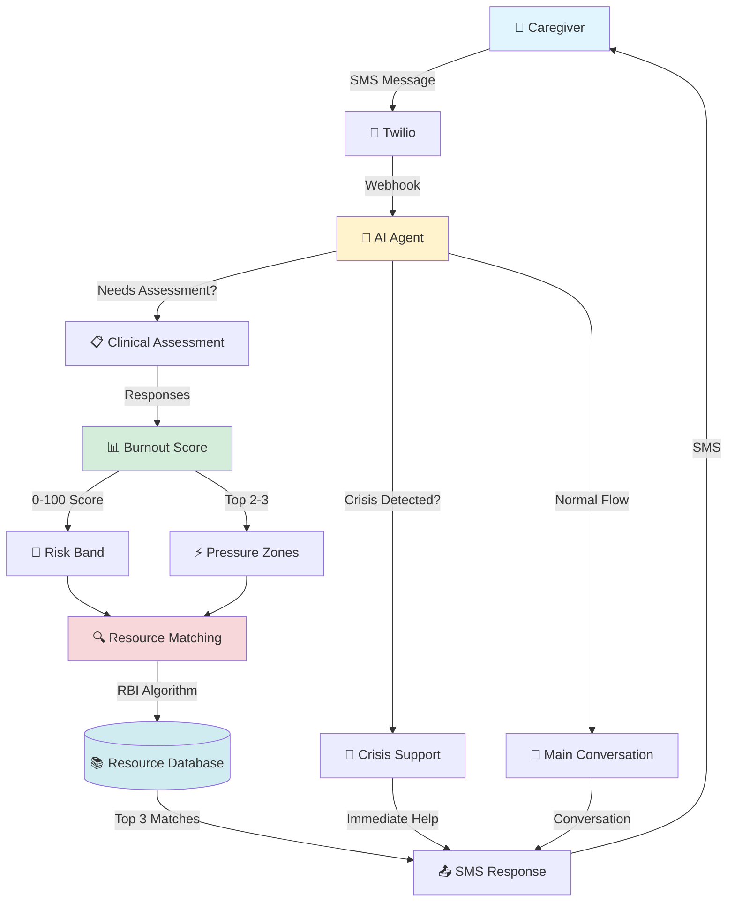

# GiveCare - Essential Architecture

## Core User Journey



## 3 Core Flows

### 1️⃣ Crisis Flow (Fastest)
```
User reports crisis → Crisis Agent → 988/911 resources → Immediate response (800ms)
```

### 2️⃣ Assessment Flow (Clinical)
```
User requests check-in → Assessment Agent → 4-20 questions → Burnout score → Pressure zones → Resources (900ms)
```

### 3️⃣ Resource Flow (Main)
```
User asks for help → Main Agent → Match to zones → RBI scoring → Top 3 resources → SMS response (900ms)
```

---

## Key Components

| Component | Purpose | Output |
|-----------|---------|--------|
| **Agent** | Understands user needs | Route to crisis/assessment/main |
| **Assessment** | 4 clinical tools (EMA, CWBS, REACH-II, SDOH) | Burnout score 0-100 |
| **Scoring** | Composite algorithm | Risk band + pressure zones |
| **Matching** | RBI algorithm (5 weighted factors) | Top 3 relevant resources |
| **Response** | Trauma-informed messaging | Actionable help via SMS |

---

## Data Flow

```
Input: "I'm exhausted and can't afford food"
  ↓
Assessment: EMA (emotional), SDOH (financial)
  ↓
Score: 72/100 (High stress)
  ↓
Zones: [physical_health, financial_concerns]
  ↓
Match: Food banks + Respite care + BenefitsCheckUp
  ↓
Output: "Things are tough. These might help:
         1. Local Food Bank (555-1234)
         2. Respite Care Finder (555-5678)
         3. BenefitsCheckUp Tool (online)"
```

---

## Simplicity Principles

1. **Single Entry**: All users start with SMS
2. **Smart Routing**: Agent determines crisis vs assessment vs conversation
3. **One Score**: Burnout 0-100 (higher = more stressed)
4. **Matched Help**: Resources ranked by relevance (RBI algorithm)
5. **Fast Response**: <1s average (900ms production)

---

**Version**: 0.7.0 (Simplified for presentations)
