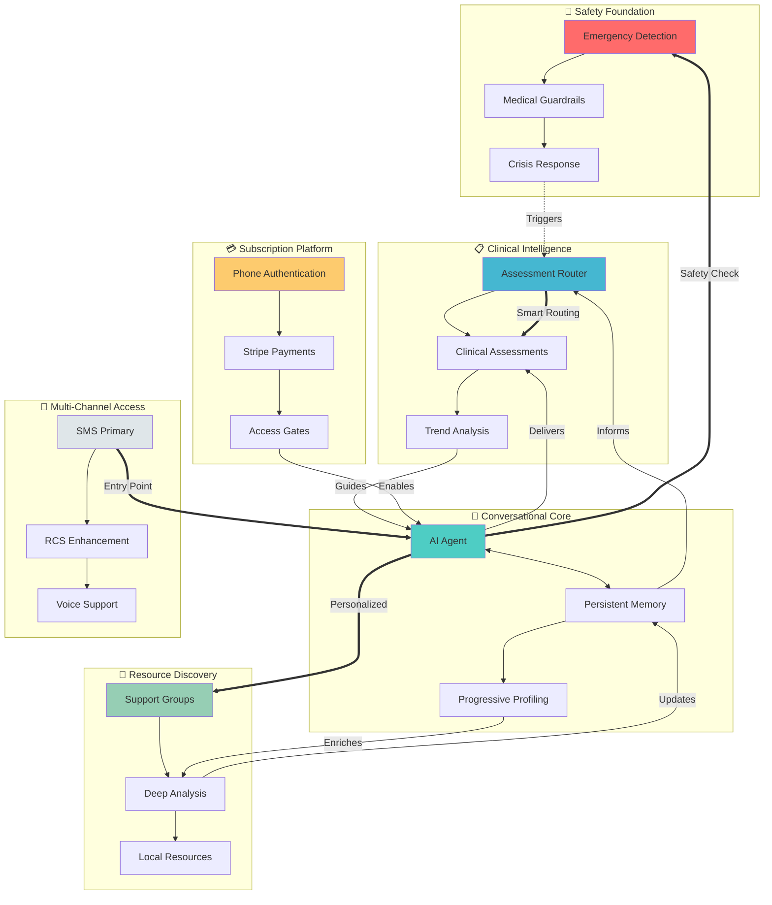

# GiveCare - Clinical-Grade SMS Caregiving AI 🤝

> **SMS-native platform delivering longitudinal EMA-based caregiver support through conversational AI**

[](https://github.com/amadad/give-care-prod/actions/workflows/deploy-guard.yml)
[](https://opensource.org/licenses/MIT)
[](https://www.python.org/downloads/)
[](https://openai.com/)
[](https://github.com/agno/framework)

---

## 🌟 What is GiveCare?

GiveCare transforms caregiver support through SMS-native AI that delivers longitudinal Ecological Momentary Assessment (EMA) through simple text conversations. Our platform provides personalized, evidence-based support through a gentle onboarding process that establishes a comprehensive caregiver profile across four key dimensions: pressure zones (stress tracking), caregiving phases (journey stage), caregiver roles (responsibility type), and coping patterns (stress management style). This multi-dimensional profiling enables truly personalized, adaptive support.

**Revolutionary approach**: Complete an 8-step conversational onboarding to establish your comprehensive caregiving profile, then receive ongoing EMA assessments (daily pressure checks, weekly phase polls, quarterly deep assessments) that adapt to your unique situation and needs.

## 🎯 Core Value Propositions



## 🚀 Quick Start

### For Caregivers
1. **Text your question** to the GiveCare number
2. **Get instant support** with personalized advice
3. **Continue conversations** - GiveCare remembers your context

### For Developers

```bash
# Clone and setup
git clone https://github.com/amadad/give-care-prod
cd give-care-prod
uv sync  # or pip install -r requirements.txt

# Configure environment
cp .env.example .env
# Edit .env with your API keys

# Run locally
uvicorn main:app --host 0.0.0.0 --port 8080 --reload

# Start reasoning processor (optional)
python -m utils.reasoning_processor

# Deploy to production
./scripts/deployment/deploy-reasoning-azure.sh
```

---

## 🎯 Feature Architecture - User Value Perspective

### **🚨 Crisis & Safety Net** 
**User Promise:** "Never alone in an emergency"
- **Emergency Detection**: Real-time keyword + context + AI validation
- **Crisis Protocols**: Evidence-based 911 guidance and intervention
- **Medical Safety**: Automatic disclaimers and professional referrals
- **PII Protection**: Privacy safeguards in every interaction

### **💬 24/7 Conversational Support**
**User Promise:** "A knowledgeable friend always in your pocket"
- **Persistent Memory**: Conversations build on months of context
- **Natural Language**: No menus, just text like messaging a friend
- **SMS Optimization**: Concise 2-3 sentence responses that respect SMS limits
- **Adaptive Personality**: Tone adjusts to user's emotional state

### **📋 EMA-Based Longitudinal Monitoring**
**User Promise:** "Hospital-quality care tracking at home"
- **Smart Onboarding**: 8-step conversational flow establishes comprehensive profile: relationship, experience, emotional state, living situation, primary concerns, support system, care duration, and care recipient details
- **Ecological Momentary Assessment**: Daily pressure zone checks (BEWRN framework), weekly phase detection polls, quarterly role reassessments, and adaptive coping pattern monitoring
- **Validated Instruments**: REACH II RAM, CWBS-SF, GC-SDOH assessments
- **Adaptive Scheduling**: Priority-based assessment delivery with compliance tracking
- **Trend Analysis**: Longitudinal tracking with risk alerts and crisis override

### **🏥 Resource & Community Connection**
**User Promise:** "Find help near you, instantly"
- **Smart Support Groups**: Location + condition-aware matching
- **Deep Care Analysis**: 1-2 minute comprehensive situation analysis
- **Local Resources**: Phone numbers, websites, meeting times
- **National Networks**: Fallback to trusted national organizations

### **📱 Multi-Channel Communication**
**User Promise:** "Rich support that meets you where you are"
- **SMS Foundation**: Works on any phone, no apps needed
- **RCS Enhancement**: Rich cards, quick replies when available
- **Voice Ready**: Infrastructure for voice conversations
- **Graceful Fallback**: Always works, enhances when possible

### **🧠 Comprehensive Multi-Dimensional Profiling & Personalization**
**User Promise:** "Support that learns and grows with you"
- **Multi-Dimensional Profile Framework**: 
  - **Pressure Zone Tracking**: Daily monitoring across 5 stress areas (Brain Load, Emotion Flux, Body Wear, Resource Drain, Network Gap) with 1-5 severity scale
  - **Phase Detection**: Automatic identification of caregiving journey stage (Onboarding, Stable Rhythm, Escalation, Crisis Sprint, Reset/Grief)
  - **Role Assessment**: Understanding caregiver type (Hands-On Lead, Care Coordinator, Task Specialist, Backup Booster, Emergent Rookie)
  - **Coping Pattern Analysis**: Identifying stress management style (Problem-Solver, Support-Seeker, Perspective-Shifter, Mind-Body Tuner)
- **SessionStateManager**: Persistent memory across all conversations using Agno Workflows 2.0
- **Personalized Messaging**: Care recipient name integration and coping-pattern adapted responses
- **Predictive Support**: EMA compliance tracking and priority-based intervention scheduling
- **No Repetition**: Complete context awareness from onboarding through ongoing support

### **💳 Frictionless Access**
**User Promise:** "Simple as texting, secure as banking"
- **Phone-Only Identity**: No usernames, passwords, or emails
- **Stripe Integration**: Secure payment with SMS confirmation
- **Grace Periods**: Never cut off during crisis
- **Transparent Billing**: Clear subscription status via text

### **📊 Quality & Trust**
**User Promise:** "Reliable support you can count on"
- **Response Tracking**: Sub-15 second guaranteed responses
- **Cost Transparency**: Know exactly what each interaction costs
- **Error Recovery**: Graceful handling of any issues
- **Continuous Improvement**: Every conversation makes us better

---

## 🔮 Feature Interconnections

### **The Safety Web**
Every feature connects to safety:
- Conversations → Emergency Detection → Crisis Response
- Assessments → Risk Scoring → Proactive Intervention
- Memory → Pattern Recognition → Early Warning

### **The Memory Nexus**
Memory powers personalization:
- Profile Data → Contextual Responses
- Assessment History → Trend Analysis
- Conversation Patterns → Predictive Support

### **The Clinical Bridge**
Natural conversation meets clinical rigor:
- Keywords → Assessment Router → Clinical Tools
- Responses → Safety Validation → Medical Compliance
- Results → Memory Storage → Longitudinal Care

### **The Access Layer**
Universal accessibility drives design:
- SMS Base → Progressive Enhancement → Rich Features
- Phone Auth → Zero Friction → Immediate Value
- Simple Billing → Transparent Access → Trust Building

---

## 💡 Untapped Potential

Based on existing infrastructure, these features could be rapidly deployed:

### **Proactive Wellness**
- Scheduled check-ins based on risk scores
- Medication reminders with refill alerts
- Mood tracking with pattern detection
- Automated wellness tips

### **Care Team Coordination**
- Family update broadcasts
- Task delegation system
- Shared care notes
- Emergency contact alerts

### **Document & Resource Hub**
- Important document storage
- Care plan repository
- Insurance navigation
- Benefits optimization

### **Advanced Analytics**
- Caregiver journey mapping
- Outcome prediction models
- Population health insights
- Cost savings calculations

### **Integration Ecosystem**
- EHR connectivity
- Wearable device data
- Telehealth platforms
- Community services

---

## 🏗️ Technical Architecture

### **Workflows 2.0 Architecture**
- **OpenAI GPT-4o-mini**: Optimized model for fast, cost-effective caregiver support conversations
- **Agno Workflows v2**: Declarative workflow engine with SessionStateManager for persistent memory
- **EMA Framework**: Longitudinal assessment scheduling with compliance tracking and priority scoring
- **Multi-Dimensional Profiling System**: Comprehensive caregiver assessment across pressure zones (BEWRN framework), journey phases (5-stage progression), caregiver roles (responsibility mapping), and coping patterns (stress response styles) - all seamlessly integrated through conversational onboarding
- **JSON Clinical Instruments**: Evidence-based assessments (REACH II, CWBS-SF, GC-SDOH) with structured delivery

### **Enterprise-Grade Safety & Compliance**
- **Three-Tier Emergency Detection**: Keyword → Context → LLM validation with automatic 911 escalation
- **Enterprise Security Foundation**: Row-level security, audit trails, structured data handling
- **Medical Safety Guardrails**: Real-time response validation with automatic medical disclaimers
- **Phoenix Observability**: Full request tracing with OpenTelemetry for comprehensive monitoring

### **Production-Ready Infrastructure**
- **SMS-Optimized Performance**: Sub-15-second response times with Twilio webhook validation
- **Phone-Based Authentication**: Zero-friction user identification via sanitized phone numbers
- **Container Deployment**: Docker + Coolify/Hetzner deployment with automated scaling
- **Supabase Backend**: PostgreSQL with real-time capabilities, Agno memory tables in ai schema
- **EMA Database Schema**: Assessment history, scheduling, compliance tracking, and longitudinal analytics
- **Comprehensive Test Suite**: Clinical workflows, safety systems, and EMA compliance validation

---

## 🏗️ Project Structure

```
give-care-prod/
├── main.py                    # FastAPI application entry point
├── src/
│   ├── config/
│   │   └── profiles.json           # Multi-dimensional caregiver profiling configuration (phases, pressure zones, roles, coping patterns)
│   ├── core/
│   │   ├── assessments.py         # Legacy assessment core (pre-Workflows 2.0)
│   │   ├── journey.py             # Legacy journey system
│   │   └── journey_tracking.py    # Message and event logging
│   ├── integrations/
│   │   ├── stripe.py              # Subscription management
│   │   └── twilio_rcs.py          # RCS/SMS response formatting
│   ├── knowledge/
│   │   ├── assessments/           # Clinical assessment definitions
│   │   │   ├── cwbs_short_v1999.json    # Caregiver Well-Being Scale
│   │   │   ├── gc-sdoh.json             # Social Determinants of Health
│   │   │   └── reach_ii_ram_v1.json     # REACH II Risk Assessment
│   │   └── caregiving/            # Support content library
│   ├── models.py                  # Updated ProfileData with EMA fields
│   ├── tools/
│   │   └── assessment_tools.py    # Assessment formatting and parsing
│   ├── utils/
│   │   └── session_manager.py     # SessionStateManager for Workflows 2.0
│   ├── workflows/                 # Agno Workflows 2.0 implementations
│   │   ├── assessment_workflow.py # EMA assessment delivery
│   │   ├── onboarding_workflow.py # 8-step onboarding flow
│   │   ├── orchestration_workflow.py # EMA scheduling and coordination
│   │   └── profile_workflow.py    # Profile extraction and updates
│   └── workflow_models.py         # UserContext and workflow data models
├── supabase/                 # Database and edge functions
├── tests/                    # Comprehensive test suite
└── docs/                     # Documentation
```

---

## 📊 Performance Metrics

| Capability | Performance | User Impact |
|------------|-------------|-------------|
| **Emergency Detection** | <100ms | Instant crisis support |
| **SMS Response Time** | <15sec | Natural conversation flow |
| **Assessment Delivery** | <2min | Real-time clinical scoring |
| **Memory Retrieval** | <500ms | Personalized responses |
| **System Availability** | 99.9% | Always-on support |

---

## 🔧 Configuration

### Environment Variables

Create a `.env` file based on `.env.example`:

```bash
# OpenAI Configuration
OPENAI_API_KEY=your-api-key

# Supabase Configuration
SUPABASE_URL=https://your-project.supabase.co
SUPABASE_KEY=your-anon-key

# Twilio Configuration
TWILIO_ACCOUNT_SID=your-account-sid
TWILIO_AUTH_TOKEN=your-auth-token
TWILIO_PHONE_NUMBER=+1234567890

# Monitoring (Optional)
PHOENIX_ENABLED=true
```

---

## 🧪 Testing

```bash
# Run all tests
pytest tests/ -v

# Run specific test categories
pytest tests/test_sms_agent.py -v        # SMS functionality
pytest tests/test_assessment_*.py -v     # Clinical assessments
pytest tests/test_guardrails.py -v       # Safety systems

# Run with coverage
pytest tests/ --cov=utils --cov=main --cov-report=html
```

---

## 🚀 Deployment

### Docker Deployment

```bash
# Build and run
docker build -t give-care .
docker run -p 8080:8080 --env-file .env give-care

# Deploy reasoning processor
./scripts/deployment/deploy-reasoning-azure.sh
```

---

## 📚 Documentation

### Core Documentation
- [Architecture](docs/ARCHITECTURE.md) - System design and patterns
- [Clinical Safety](docs/CLINICAL_SAFETY.md) - Medical guidelines and safety protocols
- [Assessments](docs/ASSESSMENTS.md) - Clinical assessment system
- [CLAUDE.md](CLAUDE.md) - AI development guidelines

### Development Resources
- [Testing Guide](docs/TESTING.md) - Test strategies
- [Deployment Guide](docs/DEPLOYMENT.md) - Deployment procedures
- [Observability](docs/OBSERVABILITY.md) - Monitoring and analytics

---

## 🤝 Contributing

We welcome contributions! Please see our [Contributing Guide](CONTRIBUTING.md) for details.

---

## 📄 License

MIT License - see [LICENSE](LICENSE) for details.

**Medical Disclaimer**: GiveCare provides general caregiving support. Always consult healthcare professionals for medical decisions and emergencies.

---

**Built with ❤️ using Agno Workflows v2, OpenAI GPT-4o-mini, and evidence-based EMA protocols**

---

## 🛡️ Beta Launch Safety Features (NEW)

### Enhanced Reliability
- **Circuit Breakers**: Automatic service failure detection and recovery
- **Message Queue**: Persistent retry mechanism prevents message loss  
- **Fallback Chains**: Multi-level fallback for all critical operations
- **Health Monitoring**: Real-time service health at `/health` endpoint

### Improved Safety
- **Emergency Fallback**: Keyword detection when AI services unavailable
- **Atomic Operations**: Race-condition-free demo limits and counters
- **Input Validation**: Comprehensive sanitization prevents injection attacks
- **Error Tracking**: Full observability integration with Langfuse

See [Safety & Reliability Improvements](docs/SAFETY_RELIABILITY_IMPROVEMENTS.md) for details.